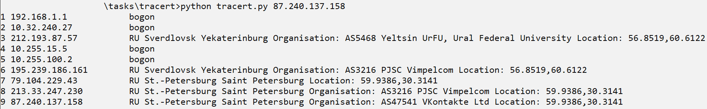

# Trace AS
Данное решение является реализацией утилиты `traceroute` с возможностью увидеть какой автономной системе и стране принадлежит каждый IP в цепочке маршрутов

## Требования
* Python версии не ниже, чем 3.6

## Справка по запуску
```
usage: tracert.py [-h] [-hops HOPS] [-timeout TIMEOUT] target

Trace Autonomous Systems

positional arguments:
  target            Целевой хост

optional arguments:
  -h, --help        show this help message and exit
  -hops HOPS        Максимальное значение TTL
  -timeout TIMEOUT  Таймаут ответа в секундах
```

## Пример запуска
```
python tracert.py 8.8.8.8
```

## Подробности реализации
* Используем втроенную утилиту tracert
* Перенаправляем из неё поток данных в нашу утилиту
* Парсим IP адреса и запрашиваем информацию о них с `ipinfo.io`

## Пример использования

